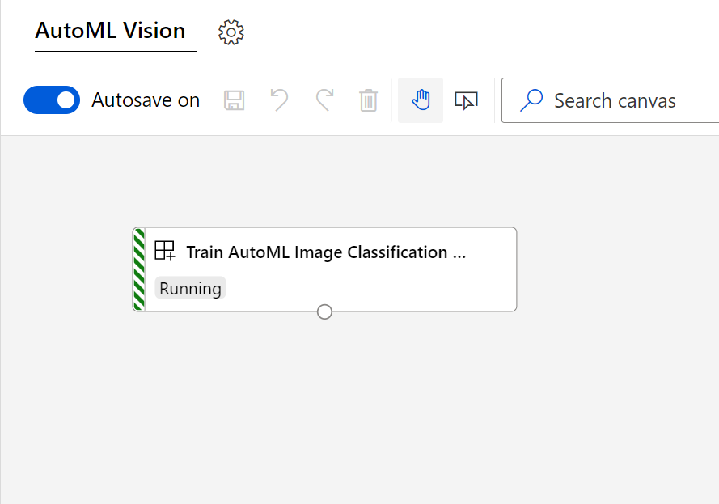

# aml-automl-vision-custom-component

A custom component for using AutoML in Designer for training AutoML Vision models. It supports the following vision use cases:

* Classification
* Object Detection



## Instructions

1. Import via the `Modules` capability in Azure Machine Learning Studio by refering the `*.spec.yaml` in this repo
1. Create and label images using Azure Machine Learning Labeling
1. Export the label project as a `Dataset`
1. Create an Service Principal with Workspace access and persist its credentials using the following code in the workspace's default Key Vault:
    ```python
    from azureml.core import Workspace, Dataset

    ws = Workspace.from_config()

    keyvault = ws.get_default_keyvault()
    keyvault.set_secret(name="automl-tenant-id", value="...")
    keyvault.set_secret(name="automl-service-principal-id", value="...")
    keyvault.set_secret(name="service-principal-password", value="...")
    ```
    This Service Principal is used by this component to start off another AutoML job on a GPU-cluster
1. Then use in Azure Machine Learning Designer and fill out the required parameters

## Known limitations

* You will need to use a Service Principal to kick off the AutoML Vision job
* Alternatively, you can run the component on a Compute Cluster by enabling the Compute Cluster's `MSI` and grant it Workspace Contributer permission
* The AutoML Vision job will run under the same experiment name, but not as a child run to the Designer's run